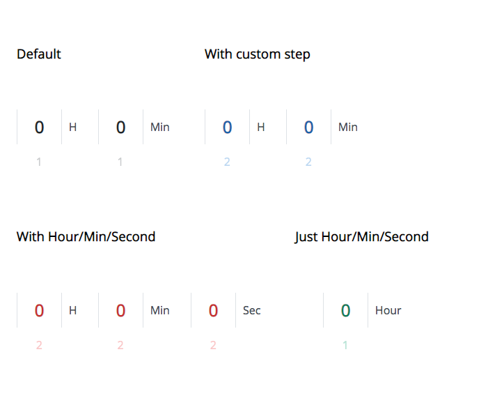
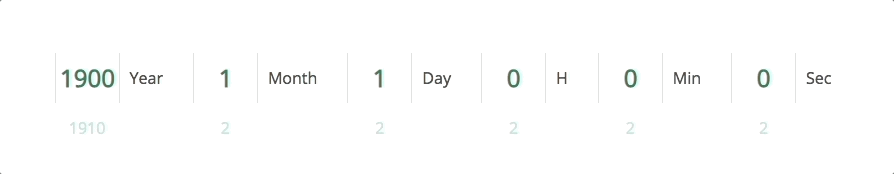
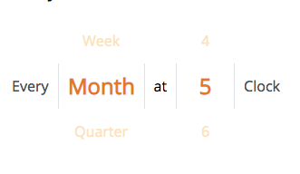

## rc-times

> A flexible and multi-purpose react time picker. Depend on react, no jQuery rely.

### Screenshots






### Usage

```bash
$ npm i rc-times --save
```

```javascript
import TimePicker from 'rc-times';
import ReactDOM from 'react-dom';
import 'rc-times/css/timepicker.css';

render() {
  return (
    <TimePicker />
  );
}
```

### Document

```javascript
// default props
{
  sections: [
    {
      step: 1,
      from: 0,
      to: 24,
      length: 0,
      times: [],
      prefix: '',
      suffix: 'H',
      activeIndex: 0,
    },
    {
      step: 1,
      from: 0,
      to: 24,
      length: 0,
      times: [],
      prefix: '',
      suffix: 'Min',
      activeIndex: 0,
    }
  ],
  color: 'dark',
  className: '',
  onTimeChange: Function.prototype
}
```

Let's look at what each props do:

#### `sections`

Array. Each item is an object contains `step`, `from`, `to`, `length`, `times`, `prefix`, `suffix`, `activeIndex` field.

  - `step`: Default/Min is `1`.
  - `length`: Default is `0`.
  - `times`: Array, default `[]`.
  - `prefix`: String.
  - `suffix`: String.
  - `activeIndex`: Default `0`.

The weight of `length`/`from`,`to`/`times`:

  1. If you have sent `times`, TimePicker will directly use it and ignore `step`/`from`/`to`/`length`.
  2. If you have sent `length`, TimePicker will render an array by using `length`, `step` and `from` (if given), and ignore `to`.
  3. Otherwise using `step`, `from` and `to` to render times.

#### `color`

String. Default `dark`. Available: `dark`, `red`, `blue`, `cyan`, `teal`, `yellow`, `green`.

#### `className`

String. Default `''`.

#### `onTimeChange`

Function. Default `Function.prototype`. It's the callback when you change any of your time.

```javascript
function onTimeChange({ indexs, values }) {
  // indexs is all the activeIndex of sections
  // values is all the actived value of sections
}
```

### Examples

```javascript
import React from 'react';
import TimePicker from 'rc-times';
import 'rc-times/css/timepicker.css';

const MONTH_DAYS = {
  // 31 days
  A: new Set([1, 3, 5, 7, 8, 10, 12]),
  // 30 days
  B: new Set([4, 6, 9, 11])
};

class TimePickerWrapper extends React.Component {
  constructor(props) {
    super(props);

    this.state = {
      // year, month, day, hour, min, sec
      activeIndexs: [0, 0, 0, 0, 0, 0]
    };
    this.onTimeChange = this.onTimeChange.bind(this);
  }

  onTimeChange({ indexs }) {
    const [yearIndex, monthIndex, dayIndex, ...others] = indexs;
    const dIndex = dayIndex >= this.getMonthDays(this.years[yearIndex], this.months[monthIndex])
      ? 0
      : dayIndex;
    this.setState({
      activeIndexs: [
        yearIndex, monthIndex, dIndex,
        ...others
      ]
    });
  }

  // You need to deal month days yourself
  getMonthDays(year, month) {
    if (MONTH_DAYS.A.has(month)) return 31;
    if (MONTH_DAYS.B.has(month)) return 30;
    return year % 4 === 0 ? 29 : 28;
  }

  get years() {
    const years = [];
    for (let i = 1900; i < 2100; i += 10) {
      years.push(i);
    }
    return years;
  }

  get months() {
    return Array.from({ length: 12 }).map((_, i) => i + 1);
  }

  render() {
    const { activeIndexs } = this.state;

    return (
      <div className="exampleWrapper">
        <div className="exampleColumn">
          <div className="exampleRow">
            <h3>Render everything you want!</h3>
            <TimePicker
              sections={[
                {
                  suffix: 'Year',
                  times: this.years,
                  activeIndex: activeIndexs[0]
                },
                {
                  suffix: 'Month',
                  times: this.months,
                  activeIndex: activeIndexs[1]
                },
                {
                  suffix: 'Day',
                  activeIndex: activeIndexs[2],
                  length: this.getMonthDays(this.years[activeIndexs[0]], this.months[activeIndexs[1]]),
                },
                {
                  step: 2,
                  from: 0,
                  to: 24,
                  suffix: 'Hour',
                  activeIndex: activeIndexs[3],
                },
                {
                  step: 2,
                  from: 0,
                  to: 60,
                  suffix: 'Min',
                  activeIndex: activeIndexs[4],
                },
                {
                  step: 2,
                  from: 0,
                  to: 60,
                  suffix: 'Sec',
                  activeIndex: activeIndexs[5],
                }
              ]}
              color="teal"
              onTimeChange={this.onTimeChange}
            />
          </div>
        </div>
      </div>
    );
  }
}
```

### TODO

- [ ] Test
- [x] Theme color
- [x] Flexible width
